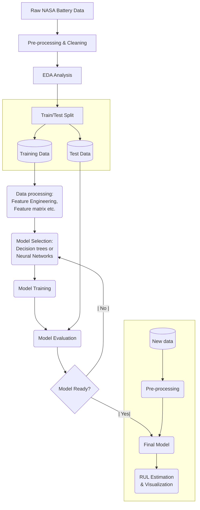

# Lithium-Ion Battery Remaining Useful Life (RUL) Estimation — Case Study Report

## 1. Introduction

This case study addresses the challenge of estimating the Remaining Useful Life (RUL) of lithium-ion batteries using open-source datasets, feature engineering, and machine learning models. The workflow encompasses data acquisition, preprocessing, feature extraction, model development, and evaluation.

---

## 2. Proposal

### Objective

- **Goal:** Estimate the Remaining Useful Life (RUL) of lithium-ion batteries using voltage, current, temperature, and other derived features.
- **Approach:** Employ feature engineering and regression-based machine learning models (Random Forest, Extra Trees, MLP, LSTM, etc.) to model battery capacity degradation and estimate RUL.

### Assumptions

- **Nominal Capacity:** 2 Ah (as per NASA dataset and 18650 Li-ion battery specs).
- **End-of-Life (EOL):** Defined as 30% fade in rated capacity (2 Ah → 1.4 Ah).
- **Open-source Data:** NASA PCoE Li-ion battery dataset is used.

---

## 3. Workflow

### Step 1: Data Acquisition & Preprocessing

- Downloaded NASA PCoE Li-ion battery dataset (.mat files).
- Parsed and converted raw data into structured CSV files for each cycle.
- Compiled metadata for each test (cycle), including type, start time, ambient temperature, battery ID, test ID, filename, capacity, and impedance features.

### Step 2: Exploratory Data Analysis (EDA)

- Visualized capacity degradation, cycle counts, and group-wise battery behavior.
- Analyzed trends in voltage, current, and temperature during charge/discharge cycles.

### Step 3: Feature Engineering

- **Cycle Count:** Number of cycles completed.
- **Depth of Discharge (DoD):** Calculated as (Capacity / Nominal Capacity) × 100.
- **Temperature Statistics:** Mean and standard deviation of measured temperature per cycle.
- **C-rate:** Maximum absolute current per cycle divided by nominal capacity.
- **Ambient Temperature:** Recorded from metadata.
- **Impedance Features:** Electrolyte resistance (Re) and charge transfer resistance (Rct) from impedance cycles.

### Step 4: Model Development

- **Target Variables:**
  - **Capacity Prediction:** Regression to predict battery capacity at each cycle.
  - **RUL Prediction:** Regression to predict cycles remaining until EOL.

- **Models Evaluated:**
  - Random Forest Regressor
  - Extra Trees Regressor
  - K-Nearest Neighbors
  - Gradient Boosting & XGBoost
  - Multi-Layer Perceptron (MLP) Regressor (with hyperparameter tuning and feature scaling)
  - LSTM Neural Network

- **Model Selection:** Extra Trees and Random Forest models performed best for RUL prediction. MLP with feature scaling and hyperparameter tuning achieved comparable results.

### Step 5: Model Evaluation & Validation

- Metrics: MAE, RMSE, R².
- Cross-validation (including GroupKFold by battery ID) to avoid data leakage.
- Residual and parity plots for error analysis.
- Feature importance analysis to refine feature set.

---

## 4. Schematic Diagram

